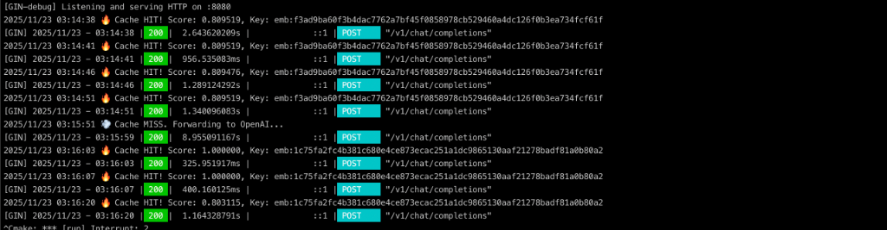

# 🚀 PromptCache

### **Reduce your LLM costs. Accelerate your application.**

**A smart semantic cache for high-scale GenAI workloads.**




> [!NOTE]
> **v0.4.0 is now available!** This release adds Bearer-token authentication
> for management endpoints, full streaming (SSE) support including streamed
> cache hits, a runtime configuration API for thresholds, and bulk cache
> warming for pre-populating from historical prompt/response pairs.
---

## 💰 The Problem

In production, **a large percentage of LLM requests are repetitive**:

* **RAG applications**: Variations of the same employee questions
* **AI Agents**: Repeated reasoning steps or tool calls
* **Support Bots**: Thousands of similar customer queries

Every redundant request means **extra token cost** and **extra latency**.

Why pay your LLM provider multiple times for the *same answer*?

---

## 💡 The Solution: PromptCache

PromptCache is a lightweight middleware that sits between your application and your LLM provider.
It uses **semantic understanding** to detect when a new prompt has *the same intent* as a previous one — and returns the cached result instantly.

---

## 📊 Key Benefits

| Metric                      | Without Cache | With PromptCache | Benefit      |
| --------------------------- | ------------- | ---------------- | ------------ |
| **Cost per 1,000 Requests** | ≈ $30         | **≈ $6**         | Lower cost   |
| **Avg Latency**         | ~1.5s         | **~300ms**       | Faster UX    |
| **Throughput**              | API-limited   | **Unlimited**    | Better scale |

Numbers vary per model, but the pattern holds across real workloads:
**semantic caching dramatically reduces cost and latency**.

\* Results may vary depending on model, usage patterns, and configuration.

---

## 🧠 Smart Semantic Matching (Safer by Design)

Naive semantic caches can be risky — they may return incorrect answers when prompts look similar but differ in intent.

PromptCache uses a **two-stage verification strategy** to ensure accuracy:

1. **High similarity → direct cache hit**
2. **Low similarity → skip cache directly**
3. **Gray zone → intent check using a small, cheap verification model**

This ensures cached responses are **semantically correct**, not just “close enough”.

---

## 🚀 Quick Start

PromptCache works as a **drop-in replacement** for the OpenAI API.

### 1. Run with Docker (Recommended)

```bash
# Clone the repo
git clone https://github.com/messkan/prompt-cache.git
cd prompt-cache

# Set your embedding provider (default: openai)
export EMBEDDING_PROVIDER=openai  # Options: openai, mistral, claude

# Set your provider API key(s)
export OPENAI_API_KEY=your_key_here
# export MISTRAL_API_KEY=your_key_here
# export ANTHROPIC_API_KEY=your_key_here
# export VOYAGE_API_KEY=your_key_here  # Required for Claude embeddings

# Run with Docker Compose
docker-compose up -d
```

### 2. Run from Source

```bash
# Clone the repository
git clone https://github.com/messkan/prompt-cache.git
cd prompt-cache

# Set environment variables
export EMBEDDING_PROVIDER=openai
export OPENAI_API_KEY=your-openai-api-key

# Option 1: Use the run script (recommended)
./scripts/run.sh

# Option 2: Use Make
make run

# Option 3: Build and run manually
go build -o prompt-cache cmd/api/main.go
./prompt-cache
```

### 3. Run Benchmarks

Test the performance and cache effectiveness:

```bash
# Set your API keys first
export OPENAI_API_KEY=your-openai-api-key

# Run the full benchmark suite (HTTP-based)
./scripts/benchmark.sh
# or
make benchmark

# Run Go micro-benchmarks (unit-level performance)
go test ./internal/semantic/... -bench=. -benchmem
# or
make bench-go
```

**Example benchmark results:**
```
BenchmarkCosineSimilarity-12      2593046    441.0 ns/op    0 B/op    0 allocs/op
BenchmarkFindSimilar-12            50000    32000 ns/op  2048 B/op   45 allocs/op
```

### 4. Available Make Commands

```bash
make help           # Show all available commands
make build          # Build the binary
make test           # Run unit tests
make benchmark      # Run full benchmark suite
make clean          # Clean build artifacts
make docker-build   # Build Docker image
make docker-run     # Run with Docker Compose
```

Simply change the `base_url` in your SDK:

```python
from openai import OpenAI

client = OpenAI(
    base_url="http://localhost:8080/v1",  # Point to PromptCache
    api_key="your-openai-api-key"
)

# First request → goes to the LLM provider
client.chat.completions.create(
    model="gpt-4",
    messages=[{"role": "user", "content": "Explain quantum physics"}]
)

# Semantically similar request → served from PromptCache
client.chat.completions.create(
    model="gpt-4",
    messages=[{"role": "user", "content": "How does quantum physics work?"}]
)
```

No code changes. Just point your client to PromptCache.

---

## 🔧 Provider Configuration

PromptCache supports multiple AI providers for embeddings and semantic verification. Select your provider using the `EMBEDDING_PROVIDER` environment variable.

### Setting the Provider

```bash
export EMBEDDING_PROVIDER=openai  # Options: openai, mistral, claude
```

If not specified, **OpenAI** is used by default.

### OpenAI (Default)
```bash
export EMBEDDING_PROVIDER=openai
export OPENAI_API_KEY=your-openai-api-key
```
- **Embedding Model**: `text-embedding-3-small`
- **Verification Model**: `gpt-4o-mini`

### Mistral AI
```bash
export EMBEDDING_PROVIDER=mistral
export MISTRAL_API_KEY=your_mistral_key
```
- **Embedding Model**: `mistral-embed`
- **Verification Model**: `mistral-small-latest`

### Claude (Anthropic)
```bash
export EMBEDDING_PROVIDER=claude
export ANTHROPIC_API_KEY=your_anthropic_key
export VOYAGE_API_KEY=your_voyage_key  # Required for embeddings
```
- **Embedding Model**: `voyage-3` (via Voyage AI)
- **Verification Model**: `claude-3-haiku-20240307`

> **Note**: Claude uses Voyage AI for embeddings as recommended by Anthropic. You'll need both API keys.

### Switching Providers

The provider is automatically selected at startup based on the `EMBEDDING_PROVIDER` environment variable. Simply set the variable and restart the service:

```bash
# Switch to Mistral
export EMBEDDING_PROVIDER=mistral
export MISTRAL_API_KEY=your_key
docker-compose restart

# Switch to Claude
export EMBEDDING_PROVIDER=claude
export ANTHROPIC_API_KEY=your_key
export VOYAGE_API_KEY=your_voyage_key
docker-compose restart
```

### Advanced Configuration

Fine-tune the semantic cache behavior with these optional environment variables:

#### Similarity Thresholds

```bash
# High threshold: Direct cache hit (default: 0.70)
# Scores >= this value return cached results immediately
export CACHE_HIGH_THRESHOLD=0.70

# Low threshold: Clear miss (default: 0.30)
# Scores < this value skip the cache entirely
export CACHE_LOW_THRESHOLD=0.30
```

**Recommended ranges:**
- High threshold: 0.65-0.85 (higher = stricter matching)
- Low threshold: 0.25-0.40 (lower = more aggressive caching)
- Always ensure: `HIGH_THRESHOLD > LOW_THRESHOLD`

#### Gray Zone Verifier

```bash
# Enable/disable LLM verification for gray zone scores (default: true)
# Gray zone = scores between low and high thresholds
export ENABLE_GRAY_ZONE_VERIFIER=true  # or false, 0, 1, yes, no
```

**When to disable:**
- Cost optimization (skip verification API calls)
- Speed priority (accept slightly lower accuracy)
- Prompts are highly standardized

**Keep enabled for:**
- Production environments requiring high accuracy
- Varied prompt patterns
- Critical applications where wrong answers are costly

---

## 🔐 Authentication

All management endpoints (`/metrics`, `/v1/stats`, `/v1/config`, `/v1/config/provider`, `/v1/cache`, `/v1/cache/warm`) are gated by a Bearer token when `API_AUTH_TOKEN` is set. The public inference endpoint (`/v1/chat/completions`) and health checks are never auth-gated.

```bash
export API_AUTH_TOKEN=your-secret-token
```

```bash
curl http://localhost:8080/v1/stats \
  -H "Authorization: Bearer your-secret-token"
```

If `API_AUTH_TOKEN` is unset, auth is disabled and a startup warning is logged. Set it for any non-local deployment.

---

## 🌊 Streaming Support

`/v1/chat/completions` now honors `"stream": true` end-to-end:

- **Cache miss**: PromptCache forwards a streaming request to the provider, streams SSE events through to the client, and buffers the assembled response for caching.
- **Cache hit**: A cached non-streaming response is synthesized into OpenAI-compatible SSE chunks (role delta → content delta → stop) so streaming clients work transparently.

```python
client.chat.completions.create(
    model="gpt-4o-mini",
    messages=[{"role": "user", "content": "Stream me a poem"}],
    stream=True,
)
```

Works across OpenAI, Mistral, and Claude (Claude's native event stream is translated to OpenAI SSE format).

---

## 🔌 API Management

### Runtime Configuration

```bash
# Read current config
curl http://localhost:8080/v1/config -H "Authorization: Bearer $API_AUTH_TOKEN"

# Update similarity thresholds and gray-zone verifier
curl -X PATCH http://localhost:8080/v1/config \
  -H "Authorization: Bearer $API_AUTH_TOKEN" \
  -H "Content-Type: application/json" \
  -d '{"high_threshold": 0.85, "low_threshold": 0.40, "enable_gray_zone_verifier": true}'
```

Validation: `0 <= low < high <= 1.0`. Invalid values return `400`.

### Cache Warming

Pre-populate the cache from historical prompt/response pairs:

```bash
curl -X POST http://localhost:8080/v1/cache/warm \
  -H "Authorization: Bearer $API_AUTH_TOKEN" \
  -H "Content-Type: application/json" \
  -d '{
    "entries": [
      {"prompt": "What is Go?", "response": {"id":"...","choices":[{"message":{"role":"assistant","content":"Go is..."}}]}}
    ]
  }'
```

Each entry computes an embedding, stores the response, and registers it in the ANN index. Embedding failures roll back the entry.

### Dynamic Provider Switching

Change the embedding provider at runtime without restarting the service.

#### Get Current Provider

Provider info is included in `GET /v1/config` (above). To switch:

#### Switch Provider

```bash
curl -X POST http://localhost:8080/v1/config/provider \
  -H "Authorization: Bearer $API_AUTH_TOKEN" \
  -H "Content-Type: application/json" \
  -d '{"provider": "mistral"}'
```

**Response:**
```json
{
  "message": "Provider updated successfully",
  "provider": "mistral"
}
```

**Use cases:**
- A/B testing different providers
- Fallback to alternative providers during outages
- Cost optimization by switching based on load
- Testing provider performance in production

---

## 🏗 Architecture Overview

Built for speed, safety, and reliability:

* **Pure Go implementation** (high concurrency, minimal overhead)
* **BadgerDB** for fast embedded persistent storage
* **In-memory caching** with LRU eviction
* **ANN Index** for fast similarity search at scale
* **OpenAI-compatible API** for seamless integration
* **Multiple Provider Support**: OpenAI, Mistral, and Claude (Anthropic)
* **Prometheus Metrics** for observability
* **Structured Logging** with JSON output
* **Docker Ready** with health checks
---

## 🛣️ Roadmap

### ✔️ v0.1.0 (Released)

* In-memory & BadgerDB storage
* Smart semantic verification (dual-threshold + intent check)
* OpenAI API compatibility

### ✔️ v0.2.0 (Released - December 2025)

* **Multiple Provider Support**: Built-in support for OpenAI, Mistral, and Claude (Anthropic)
* **Environment-Based Configuration**: Dynamic provider selection and cache tuning via environment variables
* **Configurable Thresholds**: User-definable similarity thresholds with sensible defaults
* **Gray Zone Control**: Enable/disable LLM verification for cost/speed optimization
* **Dynamic Provider Management**: Switch providers at runtime via REST API
* **Core Improvements**: Bug fixes and performance optimizations
* **Enhanced Testing**: Comprehensive unit tests for all providers and configuration
* **Better Documentation**: Updated configuration guide for all features

### ✔️ v0.3.0 (Released - January 2026)

* **Observability**: Prometheus metrics (`/metrics`), JSON stats API, structured logging
* **Health Checks**: Kubernetes-ready liveness/readiness probes
* **Cache Management API**: View stats, clear cache, delete entries
* **Reliability**: Graceful shutdown, HTTP retry with backoff, configurable timeouts
* **Performance**: ANN index for 5x faster similarity search
* **LRU Eviction**: Automatic cache size management
* **Request Tracing**: Unique request IDs for distributed tracing

### ✔️ v0.4.0 (Released - April 2026)

* **API Authentication**: Bearer-token auth gating all management endpoints (`/metrics`, `/v1/stats`, `/v1/config*`, `/v1/cache*`); set `API_AUTH_TOKEN` to enable
* **Streaming Support**: Full SSE streaming for `/v1/chat/completions` across OpenAI, Mistral, and Claude — including synthesized streams on cache hits
* **Configuration API**: `GET /v1/config` and `PATCH /v1/config` to read/update similarity thresholds and the gray-zone verifier flag at runtime
* **Cache Warming**: `POST /v1/cache/warm` to bulk pre-populate cached responses + embeddings from historical prompt/response pairs

### 🚀 v1.0.0

* Clustered mode (Raft or gossip-based replication)
* Custom embedding backends (Ollama, local models)
* Rate-limiting & request shaping
* Web dashboard (hit rate, latency, cost metrics)

### ❤️ Support the Project

We are working hard to reach **v1.0.0**! If you find this project useful, please give it a ⭐️ on GitHub and consider contributing. Your support helps us ship v0.2.0 and v1.0.0 faster!

---

## 📄 License

MIT License.

---

## 📚 Documentation

Complete documentation is available at: **[https://messkan.github.io/prompt-cache](https://messkan.github.io/prompt-cache)**

- [Getting Started Guide](https://messkan.github.io/prompt-cache/getting-started.html)
- [API Reference](https://messkan.github.io/prompt-cache/api-reference.html)
- [Configuration Guide](https://messkan.github.io/prompt-cache/configuration.html)
- [Provider Setup](https://messkan.github.io/prompt-cache/providers.html)
- [Deployment Guide](https://messkan.github.io/prompt-cache/deployment.html)
